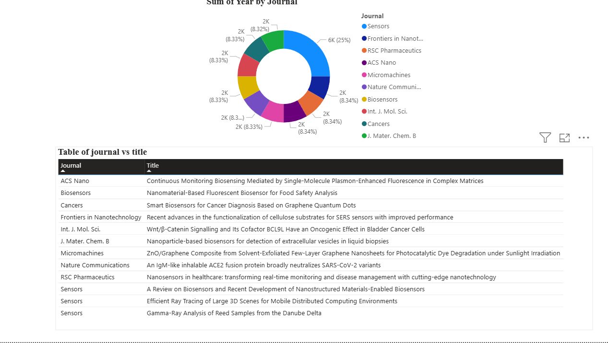
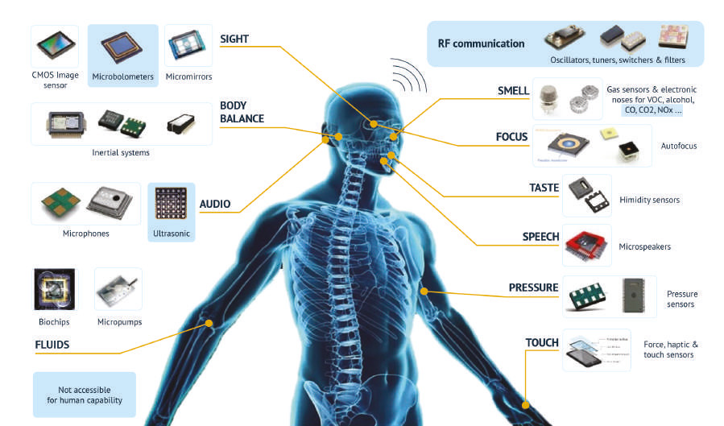
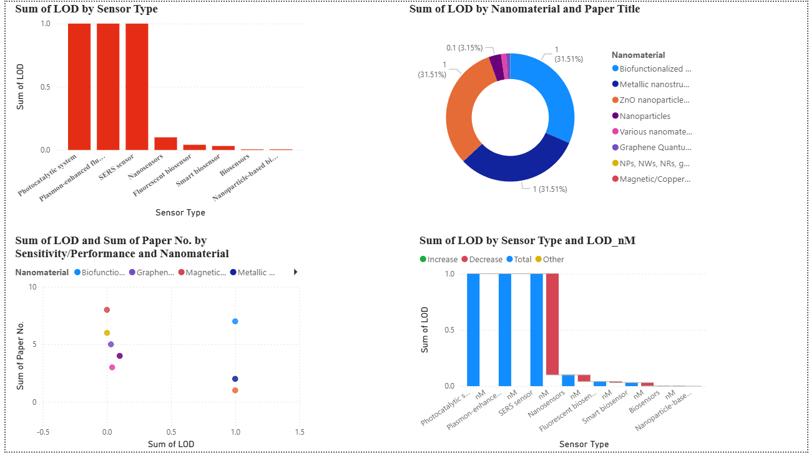

# nanosensor-review-digest
Review Digest: Top 10 Recent Nanosensor Research Papers – summaries, key findings, and infographics
# Review Digest: Top 10 Recent Nanosensor Research Papers
This repository presents a curated **digest of 10 recent research papers on nanosensors**, with a focus on biomedical and pharmaceutical applications.  
It includes **summaries, comparative tables, and infographics** to make complex research more accessible.
## 📑 Contents
- `review_digest.pdf` → Full review digest (coming soon)
- `summaries/` → Paper summaries
- `tables/` → Comparative data tables of nanosensor papers
- `infographics/` → Visual summaries of nanosensor mechanisms, applications, and outlook
## 📊 Infographics
### 1. Top 10 Nanosensor Papers (Overview)

### 2. Real-World Sensors

### 3. Review Digest Infographic

## 📈 Tables
- [Nanosensor Papers Data (CSV)](tables/nanosensor_papers_data.csv)  
- [Nanosensor Papers Data (Excel)](tables/nanosensor_papers_data.xlsx)  
- [Recent Nanosensor Papers (CSV)](tables/recent_nanosensor_papers.csv)  
- [Recent Nanosensor Papers (Excel)](tables/recent_nanosensor_papers.xlsx)
## 📌 Citation
If you use this repository, please cite:
> Hymavathi Musidipalli. *Review Digest: Top 10 Recent Nanosensor Research Papers*. GitHub, 2025.  
> Available at: [https://github.com/Hyma10/nanosensor-review-digest](https://github.com/Hyma10/nanosensor-review-digest)
## 🙌 Support
If you found this repository useful:
- ⭐ Star this repo to support the project  
- 🖇️ Share it with colleagues in **nanotechnology, biosensors, and biomedical research**  
- 📝 Contribute by suggesting additional papers, data, or visual summaries  
## 📣 Call to Action
- 🔍 Explore the summaries and tables to understand the **state of nanosensor research**  
- 📊 Use the infographics for **teaching, presentations, or research discussions**  
- 🤝 Connect with me on [LinkedIn](https://www.linkedin.com/in/musidipallihymavathi/)  
- 📖 Read my related blogs on [Medium](https://medium.com/@hymavathimusidipalli)  

**Author:** Hymavathi Musidipalli  
*M.Tech Nanotechnology | B.Pharm | Independent Researcher*  
[LinkedIn](https://www.linkedin.com/in/musidipallihymavathi/) | [Medium](https://medium.com/@hymavathimusidipalli)
